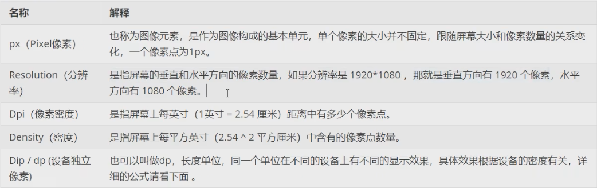
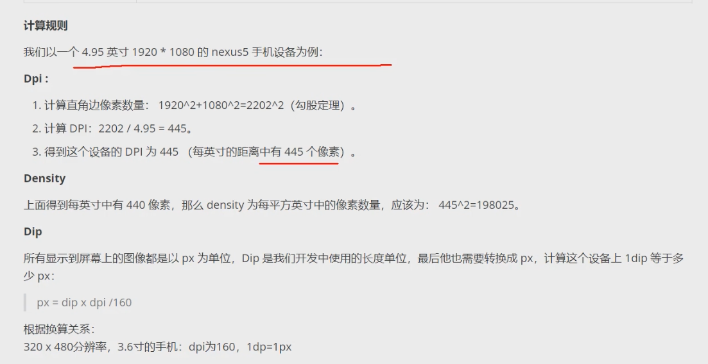

### 01 设置文本的内容

设置文本内容有两种方式：

1. 在 XML 文件中通过属性 `android:text="..."` 设置文本。
2. 在 Java 代码中调用**文本视图对象**的 `setText` 方法设置文本。

```xml
// src/res/values/strings.xml
<resources>
	<string name="app_name">AppName</string>
  <string name="hello">hello, world</string>
</resources>
```

```xml
// src/res/layout/activity_text_view.xml
<?xml version="1.0" encoding="utf-8"?>
<LinearLayout xmlns:android="http://schemas.android.com/apk/res/android"
              android:layout_width="match_parent"
              android:layout_height="match_parent">
  <TextView
            android:id="@+id/tv_hello"
            android:layout_width="wrap_content"
            android:layout_height="wrap_content"
            android:text="@string/hello"/> // 1

</LinearLayout>
```

- 在布局文件中引用 values/strings.xml 内名称为 `hello` 的文本：`@string/hello`。
- 在 Activity 文件中引用： `R.string.hello`。

```java
// src/main/java/com.ziran.app/TextViewActivity
import android.widget.TextView;
import androidx.annotation.Nullable;
import androidx.appcompat.app.AppCompatActivity;

public class TextViewActivity extends AppCompatActivity {
  @Override
  protected void onCreate(@Nullable Bundle savedInstanceState) {
    super.onCreate(savedInstanceState);
    setContentView(R.layout.activity_text_view);// layout 目录下的对应文件名
    TextView tv_hello = findViewById(R.id.tv_hello);
    tv_hello.setText(R.string.hello); // 2
  }
}
```

### 02 设置文本的大小

设置文本大小有两种方式：

1. 在 XML 文件中通过属性 `android:textSize="..."` 设置，需要指定字号单位。
2. 在 Java 代码中调用**文本视图对象**的 `setTextSize` 方法设置文本大小。

字号单位：

- px：手机屏幕的最小显示单位。
- dp：与设备无关，只和屏幕尺寸有关。
- sp：专门用于设置字体大小，在系统设置中可以调整字体大小。





